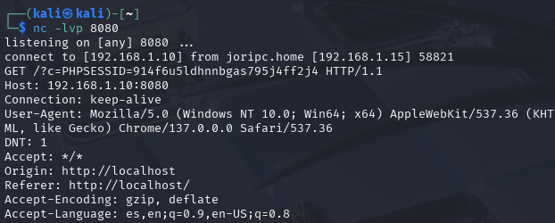
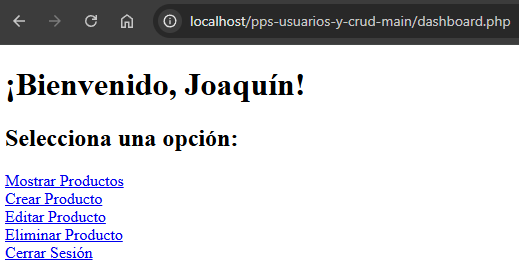
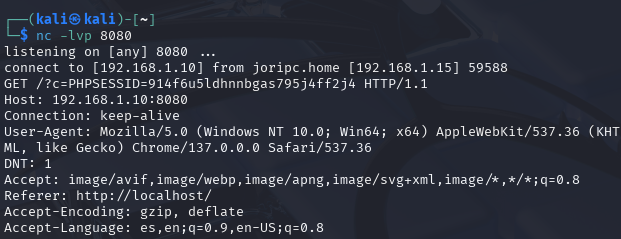

# PPS-Usuarios-y-Crud Reflected XSS
Mi aplicación no es vulnerable a XSS reflejado ya que:

- Los productos en mostrar_tabla.php se muestran usando htmlspecialchars lo cual evita que un usuario inyecte código JS o HTML malicioso.
- Los formularios para crear y editar productos no muestran los valores del usuario en la respuesta sin escapar evitando ataques de xss.
- Los alert de error y éxito se muestran sin datos del usuario evitando filtrarlos.
- No se muestran resultados de forma directa que se hayan recibido por GET o POST sin una validación previa.

# Robo de Cookie de sesión método POST
Abrimos una conexión con netcat en la máquina maliciosa que escucha al puerto 8080

Cuando el usuario cargue la página ataque_xss_post.html se enviará el formulario de buscar_producto_xss_post.php enviando la cookie de sesión.

Llega la información a la máquina maliciosa

Si intentamos entrar sin cookie nos indica que iniciemos sesión

Pero al introducir la cookie robada

Ya estamos dentro como el usuario.

(Los directorios del crud podemos encontrarlos haciendo un análisis con herramientas como dirsearch)

# Robo de Cookie de sesión método GET

En este caso el payload irá directamente en la URL y codificado

Al acceder en nuestra máqunina maliciosa que está escuchando obtenemos la cookie:
